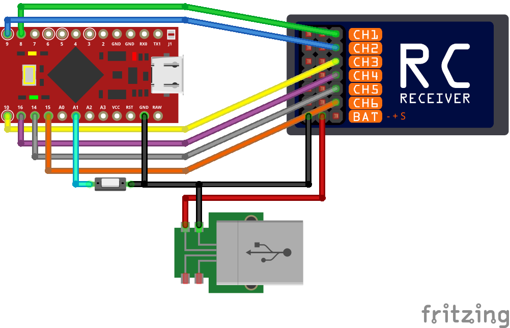

# RC Receiver USB Adapter

**Arduino based game controller adapter for regular RC receivers up to 6 channels.**

It acts as an USB joystick, dispatching the channels values read from a regular RC receiver. Aimed to be fast and responsible, though simple to use with automatic calibration function. It can be useful to play simulator wireless from the computer with your favourite transmitter. Compatible with **Windows**, **Mac**, **Linux**, **Android**,**IOS**.

## Parts-list
 - [**Sparkfun Pro Micro** (5v/16Mhz)](http://www.ebay.com/sch/i.html?_from=R40&_trksid=p2050601.m570.l1313.TR0.TRC0.H0.Xatmega32u4.TRS0&_nkw=atmega32u4&_sacat=0)
 - [**6 CH RC receiver** (PWM, 5v)](http://www.ebay.com/sch/i.html?_from=R40&_trksid=p2050601.m570.l1313.TR3.TRC2.A0.H0.Xfs-r6b.TRS0&_nkw=fs-r6b&_sacat=0)
 - [**Tactile SPST switch** (momentary pushbutton)](http://www.ebay.com/sch/i.html?_from=R40&_trksid=p2050601.m570.l1313.TR10.TRC2.A0.H0.Xspst+switch+smd.TRS0&_nkw=spst+switch+smd&_sacat=0)
 - [**some jumper wires** (female-female)](http://www.ebay.com/sch/i.html?_from=R40&_trksid=p2050601.m570.l1313.TR12.TRC2.A0.H0.Xjumper+wire+arduino.TRS0&_nkw=jumper+wire+arduino&_sacat=0)

## Requirements
The code is **mostly written for Sparkfun Pro Micro**, since it is based on ATmega 32U4 and can act as a game controller on USB. Though it may compile fine on other boards also (eg. Leonardo). Some jumperwires are needed to connect the receiver to the Pro Micro. Below on the picture you can see an example of wiring and setup in details.

To upload this particular piece of code on the Pro Micro you're going to need Arduino IDE 1.8.2 at least.

## Wiring
<a href="http://raw.githubusercontent.com/gregnau/wireless_rc_adapter/master/wiring.png" target="_blank"></a>

## Manual
The Pro Micro boards usually have 2 leds side-by-side, which are the TX and RX status lights. These are used to reflect the state of the adapter:
On every startup these are flashing twice, then one of them is going off, the other one stays on. This means booted up successfully and ready to play.
But if they stay on, that means the adapter is in calibration mode. The calibration data is loaded and verified during setup,
but if these are incorrect/missing then it goes to calibration mode automatically.

**Automatic calibration**:

Calibration process is the same as everywhere, the sticks, pots, switches on all channels must moved to their extents. Preferably more than once and in slow motion.
The leds are lit.

During calibration there is no sending of joystick values to the host, there is no feedback at all, except it is in ```#DEBUG_ENABLED``` mode. Though in debug mode it's only using terminal to send data, there is no HID interface. While in normal operation after the calibration data is accepted and saved it goes directly to play mode. 


**Manual calibration**:

Sometimes it is needed to re-calibrate the adapter, although there is valid calibration data saved. To achieve that just plug in the usb while pushing the attached button. Then everything should be the same as with automatic process.


---
> **Still under development so any advice is welcome regarding the code or feedback on use! Only known restriction is the calibration autosave function accepts only if there are 6 working channels calibrated. In case you connect less channels then you always need to push the button to save calibration data.**
